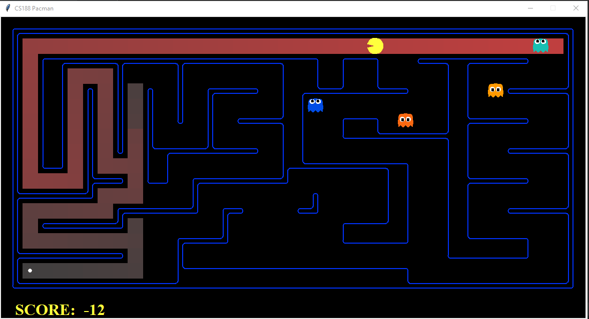
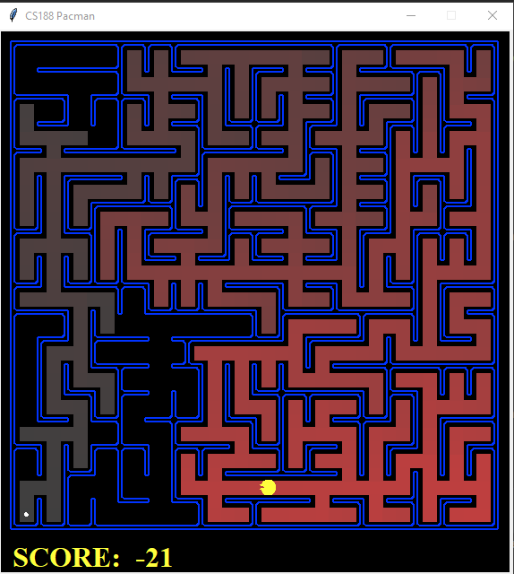

# Artificial-Intelligence
- Task 1 - Pacman - Search Problems.

## Task 1 - Pacman
Demonstrating how to solve problems by searching as part of Artificial Intelligence course at Bar Ilan University. 
The main goal of this exercise is to define and implement searching problems, solve them using uninformed search and heuristic search.

There is a list of commands(commands.txt) initiating different mazes with different goals using a number of algorithms:
1. Implemented DFS(Graph Search) using Stack.
2. Implemented BFS(Graph Search) using Queue.
3. Implemented Uniform Cost Search using Priority Queue.
4. Implemented A* Search using Priority Queue.

Defined Corners-Problem search problem: State, Goal and Successors.

Implemented Heuristic function(admissible and consistent) for Corners-Problem and Food Search-Problem. 
Function calculates Manhattan distances from current position to closest goal in each state.

